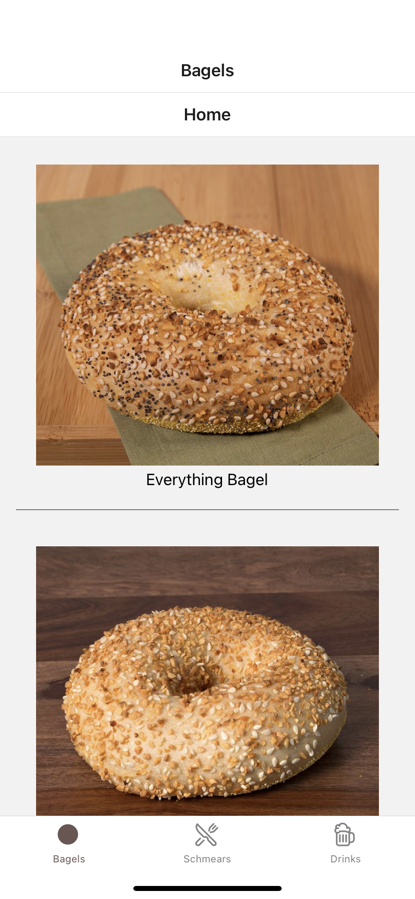
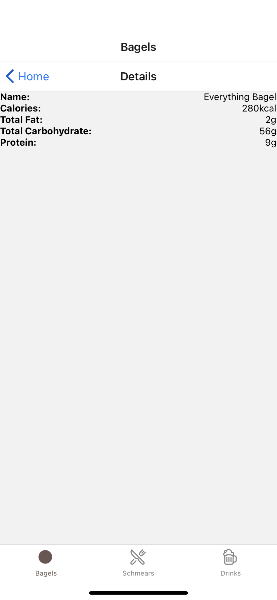

# Matthew's Bagels Menu

## Description
A bagel shop menu using React Native.

## How to Use
1. Download the Expo Go app from the App Store or Google Play.
2. Goto the Expo page I currently have Matthew's Bagels Menu on [here](https://expo.dev/@matthewwei35/matthews-bagels).
3. Scan the QR code, this should take you to the Expo Go app.
4. Explore the menu!

## Screenshots

